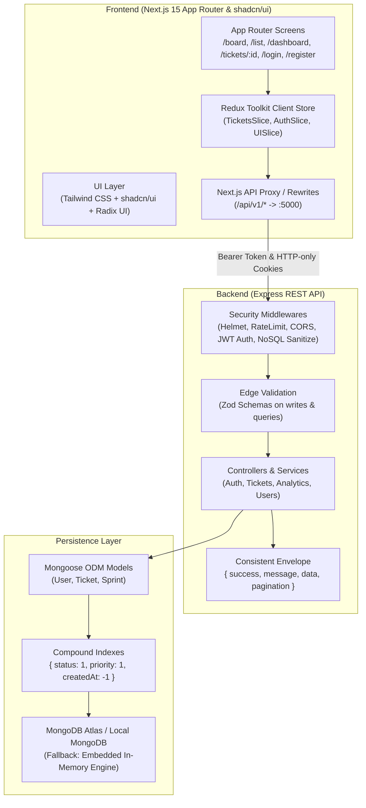

# 🚀 Jira Cloud Full-Stack Agile Platform

A production-grade, full-stack clone of **Atlassian Jira**, engineered with **Next.js 15 (App Router)**, **shadcn/ui**, **Redux Toolkit**, and a decoupled **Express.js REST API** backed by **MongoDB & Mongoose**.

---

## 📐 Architecture Overview



---

## ✨ Features Checklist

### 🎨 Week 3 — Frontend (Next.js 15 & shadcn/ui)
- [x] **Next.js App Router**: File-based routing with nested layouts, SEO metadata, streaming, and error boundaries.
- [x] **shadcn/ui & Tailwind CSS**: Component primitives (`Button`, `Input`, `Dialog`, `Table`, `Toast`, `DropdownMenu`, `Tabs`, `Card`, `Badge`, `Skeleton`) with accessible Radix UI foundations.
- [x] **Theming & Dark Mode**: Seamless toggle between classic Atlassian Blue and sleek Dark mode via CSS variables (`next-themes`).
- [x] **Redux Toolkit State Management**: Hydration-safe client provider (`StoreProvider`) holding optimistic Kanban state, active filters, and session auth.
- [x] **Core Product Views**:
  - **Kanban Board** (`/board`): Drag & drop column transitions (`TO DO`, `IN PROGRESS`, `IN REVIEW`, `DONE`), quick issue creator, sprint progress bar.
  - **All Issues Table** (`/list`): Multi-column sorting (`Key`, `Title`, `Priority`, `Status`, `Story Points`), keyword search, and pagination.
  - **Dynamic Issue Detail** (`/tickets/[id]`): Rich text WYSIWYG editor, discussion comments stream, assignee/reporter selectors, and status switcher.
  - **Sprint Dashboard** (`/dashboard`): Velocity metrics, completion percentages, WIP gauges, and team workload allocation.
  - **Authentication Screens** (`/login`, `/register`): 1-click demo account quick logins, role selection (`admin`, `lead`, `developer`, `viewer`), and error feedback.

### 🛡️ Week 4 — Backend (Express & MongoDB)
- [x] **Express REST Architecture**: Decoupled routes, controllers, services, centralized error handling with `asyncHandler`, and standard response envelopes.
- [x] **MongoDB & Mongoose**: `User`, `Ticket`, and `Sprint` models with compound indexes, bcrypt password hashing, and user population references.
- [x] **Edge Validation with Zod**: Every write (`POST`, `PUT`, `PATCH`) and query parameter is strictly validated before hitting controller logic.
- [x] **Auth & OWASP Security**:
  - `bcryptjs` salt rounds = 12
  - Short-lived JWT Access Tokens (15m) + Rotating Refresh Tokens (7d)
  - HTTP-only cookies and `Authorization: Bearer <token>` support
  - Role-Based Access Control (`requireRole`)
  - `helmet`, `express-rate-limit`, NoSQL operator injection sanitization, and CORS with credentials
- [x] **Resilient MongoDB Engine**: Connects immediately to your MongoDB Atlas connection string, or transparently falls back to an embedded in-memory MongoDB instance for zero-config testing.
- [x] **Automated Integration Tests**: Vitest + Supertest suite testing the auth lifecycle and ticket CRUD operations.
- [x] **DevOps & CI/CD**: Production `Dockerfile`, `docker-compose.yml`, and GitHub Actions workflow (`.github/workflows/ci.yml`).

---

## ⚡ Quickstart

### 1. Install Dependencies
```bash
# Install root (Next.js) dependencies
npm install

# Install backend dependencies
cd server && npm install && cd ..
```

### 2. Configure MongoDB URL
Open `server/.env` (or copy from `server/.env.example`):
```env
MONGODB_URI=your-mongodb-atlas-url-or-local-url
PORT=5000
JWT_SECRET=your-secure-jwt-secret-string
JWT_REFRESH_SECRET=your-secure-refresh-jwt-secret
```
> **Note**: If `MONGODB_URI` is left blank or points to a non-running local port, the backend **automatically starts an in-memory MongoDB engine**, so the entire application runs instantly without crashing!

### 3. Seed Realistic Jira Data
Populate realistic users, an active sprint, and 14+ issues with rich markdown descriptions:
```bash
npm run seed
```

**Pre-seeded Demo Credentials:**
| Name | Email | Password | Role |
| :--- | :--- | :--- | :--- |
| **Alex Morgan** | `alex.morgan@acme-jira.io` | `jira1234` | Admin |
| **Sarah Connor** | `sarah.connor@acme-jira.io` | `jira1234` | Tech Lead |
| **Marcus Vance** | `marcus.vance@acme-jira.io` | `jira1234` | Developer |
| **Elena Rostova** | `elena.rostova@acme-jira.io` | `jira1234` | Developer |

*(You can also click the 1-click Demo buttons directly on the `/login` screen!)*

### 4. Run the Full-Stack Application
Start both the Next.js frontend (`:3000`) and the Express REST API (`:5000`) with one command:
```bash
npm run dev
```

Visit:
- **Frontend**: [http://localhost:3000](http://localhost:3000)
- **Backend API**: [http://localhost:5000/api](http://localhost:5000/api)
- **Health Check**: [http://localhost:5000/api/health](http://localhost:5000/api/health)

---

## 🧪 Running Automated Tests

Run the complete backend integration test suite with Vitest and Supertest:
```bash
npm test
```
Tests cover:
- User registration and bcrypt password hashing
- Duplicate email prevention (409)
- Authentication and token issuance
- Invalid credential rejection (401)
- Ticket sequential key generation (`PROJ-101`)
- Zod edge validation on ticket writes (400 Bad Request)
- Ticket pagination and filtering
- Drag-and-drop status transitions
- Discussion comments threading
- Ticket deletion

---

## 🐳 Docker Deployment

Run MongoDB and the Express API in isolated Docker containers:
```bash
docker compose up --build
```

---

## 🧠 Architectural Trade-Offs & Decisions

### 1. Separate Express API vs. Next.js Full-Stack (Route Handlers)
* **Decision**: We decoupled the core business logic into a dedicated Express REST API while keeping lightweight Route Handlers in Next.js for fallback resilience.
* **Why**:
  - **Independent Scaling & Deployment**: A high-velocity engineering organization often needs the API to scale independently on microservices (Render/Railway/ECS/Kubernetes) while the Next.js frontend is distributed via global Edge CDNs (Vercel/Cloudflare).
  - **Multi-Client Support**: An Express REST API can effortlessly serve web, React Native mobile apps, desktop apps, and webhook integrations with uniform JWT authentication and middleware chains (rate limiting, NoSQL sanitization).
  - **Simpler Long-Running Tasks**: Background jobs, webhook listeners, and WebSocket streaming are simpler to manage in an Express server process than in ephemeral serverless functions.

### 2. Redux Toolkit vs. TanStack Query
* **Decision**: Redux Toolkit for complex client state and optimistic UI updates; TanStack Query for server state caching.
* **Why**:
  - **Complex Client Interactivity**: Kanban boards require heavy cross-component client state—active filters (priority, assignee, search), column drag & drop, modal drawers, and optimistic status updates. Redux Toolkit manages this deterministic state with zero hydration mismatches via `StoreProvider`.
  - **Server vs. Client State Rule**: Data belonging to the database (tickets, users) is server state fetched via async thunks; transient UI state (active tab, search filter, sidebar collapsed, modal open) is pure client state in `uiSlice`.

### 3. shadcn/ui vs. Ant Design
* **Decision**: We chose **shadcn/ui** (Tailwind CSS + Radix UI) over Ant Design.
* **Why**:
  - **Code Ownership (Copy-In Model)**: With shadcn/ui, the component code lives directly in `src/components/ui/`. There is no monolithic 5MB NPM package or black-box CSS overrides.
  - **Design Freedom & Performance**: Ant Design imposes rigid opinionated styling and heavy CSS-in-JS runtimes that degrade Next.js SSR performance. shadcn/ui uses CSS variables (`hsl(var(--background))`) and headless Radix UI primitives, resulting in superior Lighthouse performance, seamless dark mode, and complete keyboard accessibility (WCAG compliant).
